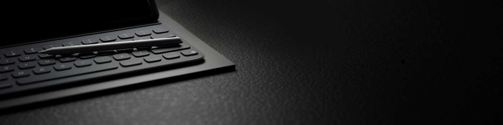

 

&nbsp;&nbsp;&nbsp;

<h1 align="center">Transformando Café em Codigo.   </h1> 
 Como profissional, meu objetivo é aprimorar a presença online da sua empresa. Com experiência em design gráfico, unindo minha paixão pelo design à missão de proporcionar uma experiência superior na web para as empresas.
 &nbsp;

## Minhas Habilidades

#### PRINCIPAIS:

&nbsp;
&nbsp;
&nbsp;
&nbsp;
&nbsp;

&nbsp;
&nbsp;

#### ESTUDANDO NO MOMENTO:

&nbsp;
&nbsp;

&nbsp;
&nbsp;

#### CONTATOS:

 

 

  
  

